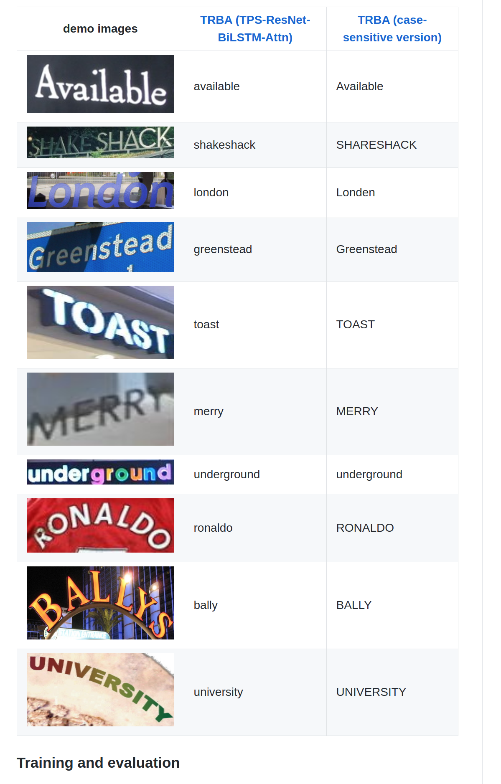
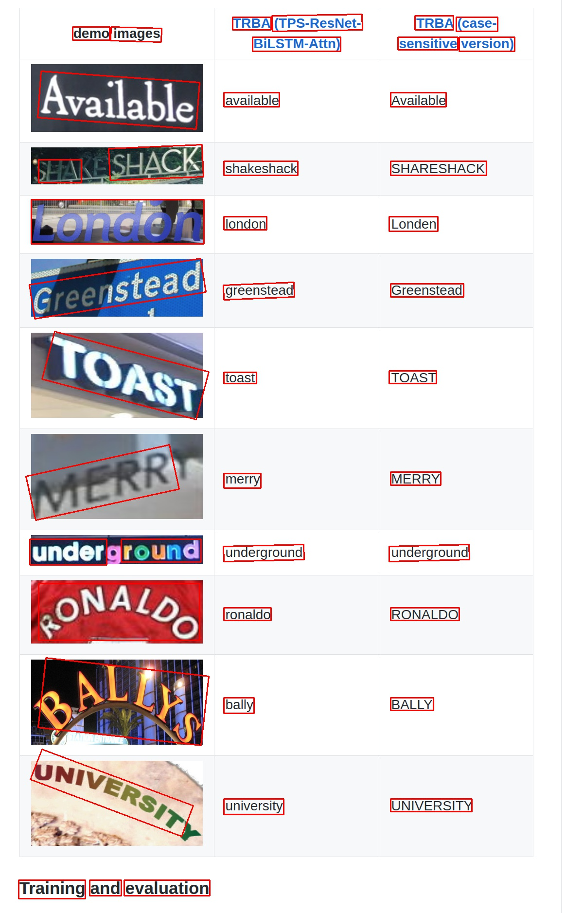

# [CRAFT-PyTorch](https://github.com/clovaai/CRAFT-pytorch)

This model is responsible for text *detection* in images.
Essentially, it identifies regions in images that look like they contain words or characters and then gives you the bounding box.

For example:

Source             |  CRAFT Output
:-------------------------:|:-------------------------:
  |  


## Building the container

```bash
# Test on some demo images
conda activate app && python CRAFT-pytorch/test.py --trained_model=./models/craft_mlt_25k.pth --test_folder=/workdir/images/source

# Without CUDA
conda activate app && python CRAFT-pytorch/test.py --trained_model=./models/craft_mlt_25k.pth --test_folder=/workdir/images/source --cuda=False
```

The output will be saved in `./result`.

It works pretty well!

# [Clova AI Deep Text Recognition Benchmark](https://github.com/clovaai/deep-text-recognition-benchmark)

Despite the name, this repo corresponds to a paper (and published model) reporting very good results for scene text in photographs.

They have a couple models available, with the best one being **TRBA**, short for **T**PS-**R**esNet-**B**iLSTM-**A**ttn, which combines a number of techniques into an acronym that would make an NYC realtor jealous.

*("NYC" is short for "New York City").*

## Building and running

Assuming you have a CUDA-capable GPU, the [`Makefile`](./Makefile) should have you *mostly* covered.

One possible issue is that the model files are stored on Google Drive, which makes downloading the files via `wget` or `curl` a bit of a hassle.
However, there's a neat trick from [Martin Pecka on StackOverflow](https://stackoverflow.com/a/32742700) for getting them anyways, which I attempt to employ:

```bash
# Try downloading the models via Martin Pecka's trick
make download-models
```

If that doesn't work, you'll have to download the model and save it.
I have only implemented the best performing model (TRBA) at the moment.

```bash
# Build the container
make build-dtrb-container

# Run the container
make run-dtrb-container
```

You can run the demo via:

```bash
# Activate the conda environment where the dependencies were installed
conda activate app

# Go to repo directory
cd deep-text-recognition-benchmark

# Actually run the demo
CUDA_VISIBLE_DEVICES=0 python3 demo.py \
    --Transformation TPS \
    --FeatureExtraction ResNet \
    --SequenceModeling BiLSTM \
    --Prediction Attn \
    --image_folder demo_image/ \
    --saved_model /workdir/models/TPS-ResNet-BiLSTM-Attn.pth
```


# Notes and Remarks

## Building the images

I experienced some tribulations resulting from package version conflicts, even using `conda`.
First, there wasn't a satisfiable set of packages with Python 3.7.
So I tried using the `conda-forge` channel alone, then added the `pytorch` and `nvidia` channels ahead of `conda-forge`, which seemed like it could produce a viable environment.

But this caused the `base` environment to upgrade, since the Dockerfile I based the miniconda part on was outdated, which then caused `conda` to break.
So, if you're trying to do something similar, first upgrade `conda` (or fix it to a known version) and then begin creating environments/installing dependencies.

The real struggle began when I tried to get an environment that would satisfy the requirements for *both* CRAFT and DTRB in order to get some sort of pipeline working, with the result being `environment.yml`.

# References

- [Clova AI Deep Text Recognition Benchmark](https://github.com/clovaai/deep-text-recognition-benchmark)
- [CRAFT-PyTorch](https://github.com/clovaai/CRAFT-pytorch)
- [The `miniconda` installer repository](https://repo.anaconda.com/miniconda/)
